# Screenshots — PC Health Check

Capturas reais da interface do MVP (desktop 1440×900 e mobile 390×844).

## Landing page

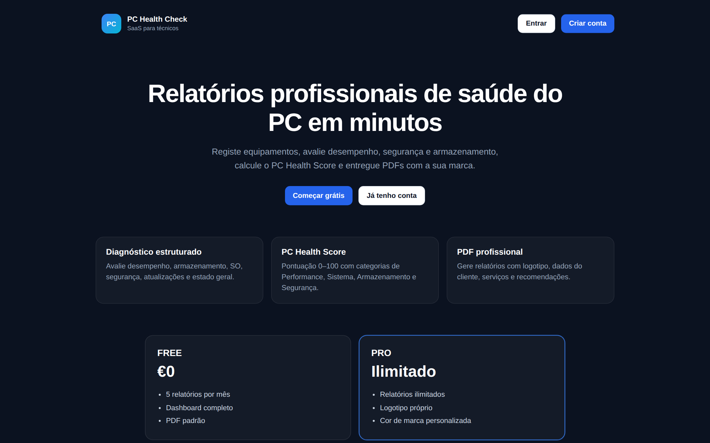

Versão mobile:

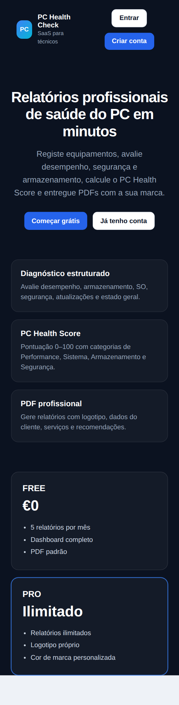

## Autenticação

| Registo | Login |
|---------|-------|
| 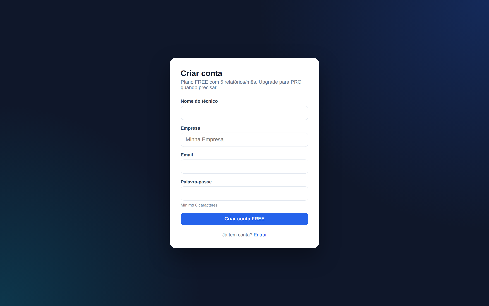 | 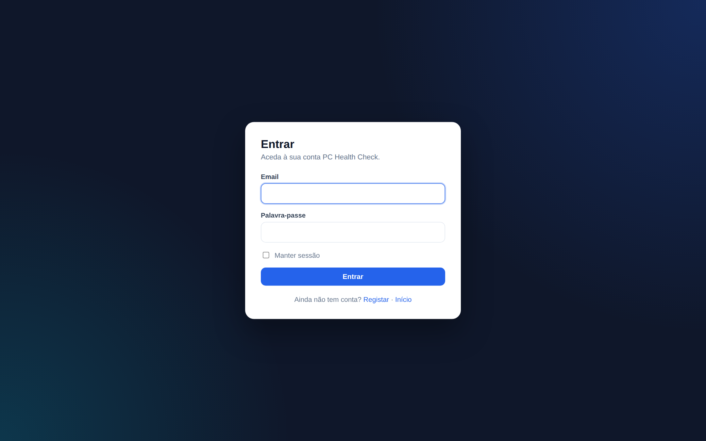 |

## Dashboard

Com dados de exemplo (computadores, score médio, utilização do plano):

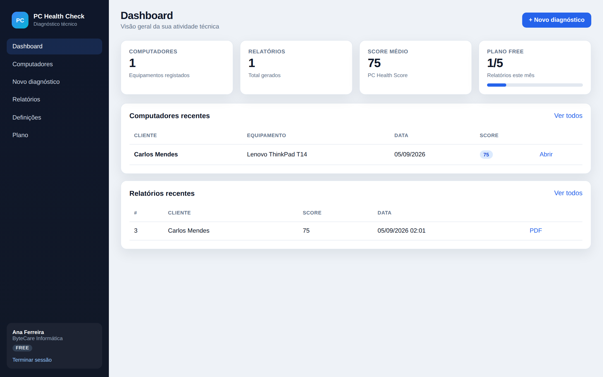

Estado inicial (sem diagnósticos):

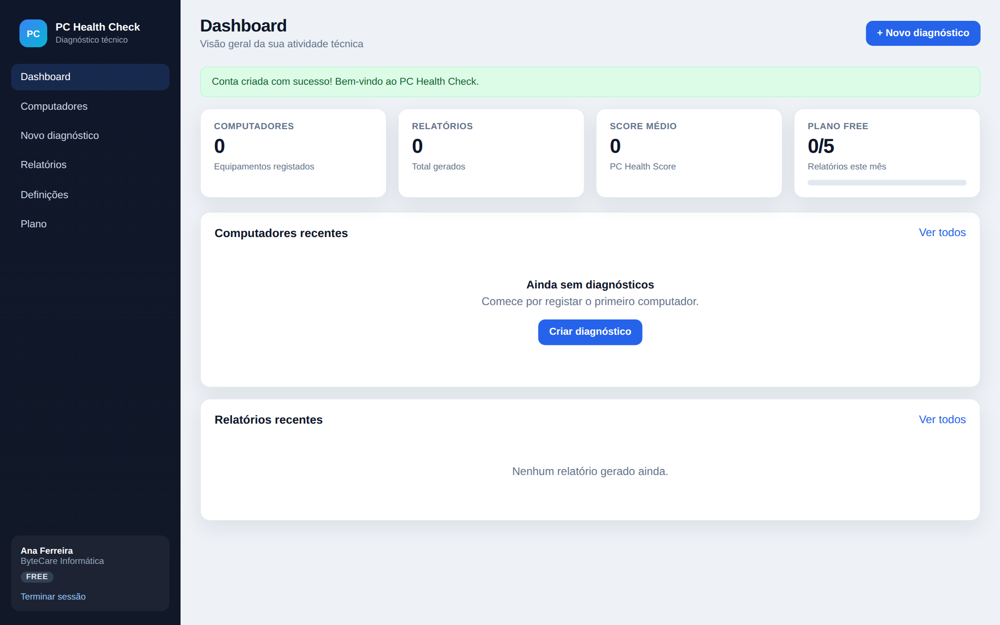

## Novo diagnóstico

Formulário completo: equipamento, avaliações, serviços e recomendações.

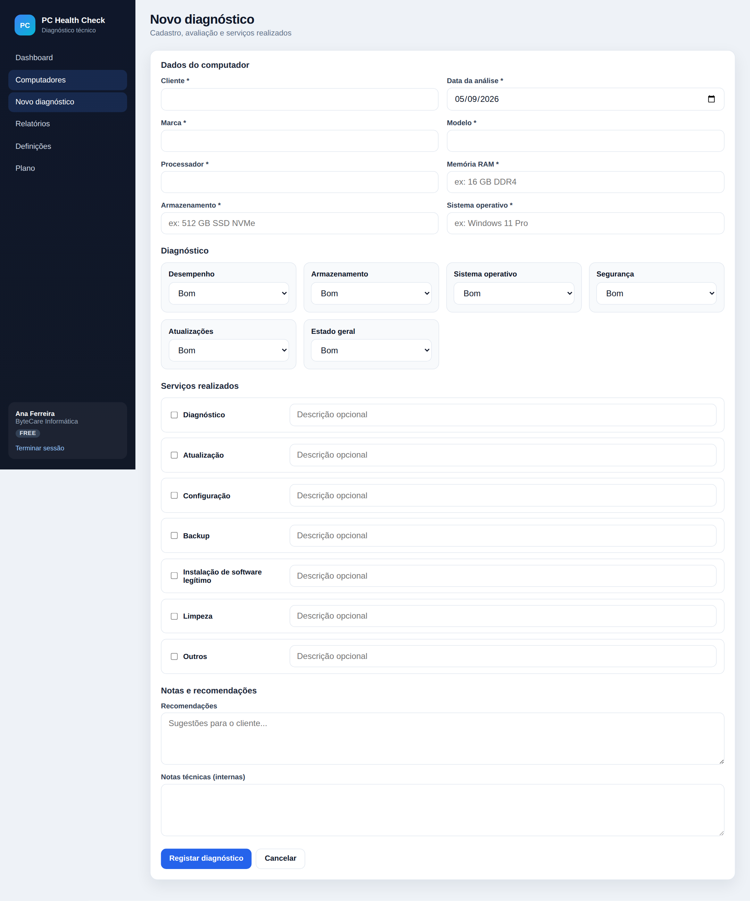

## Detalhe do computador + PC Health Score

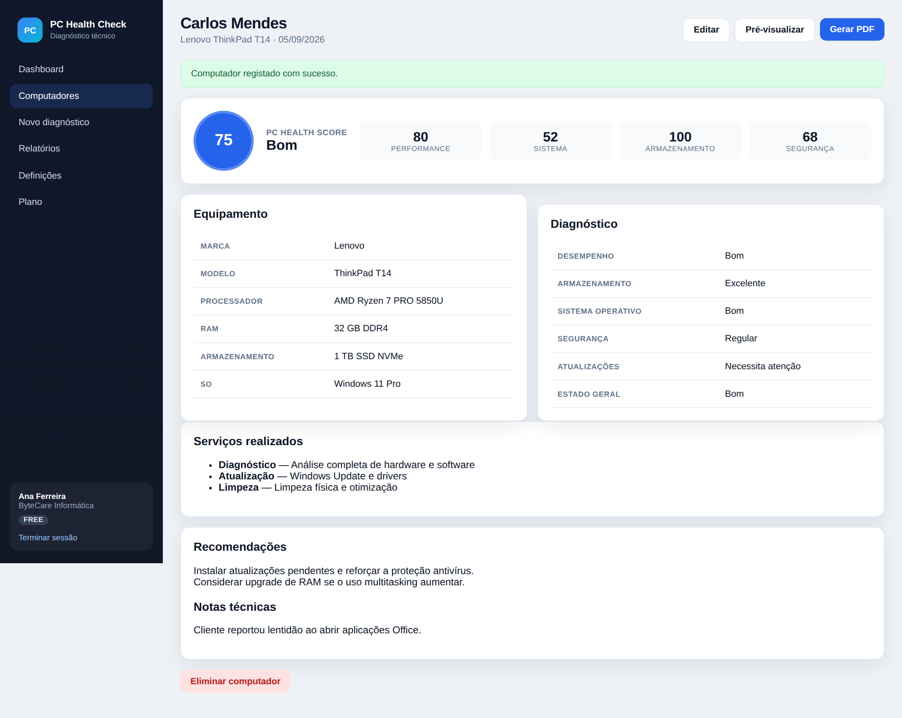

## Lista de computadores

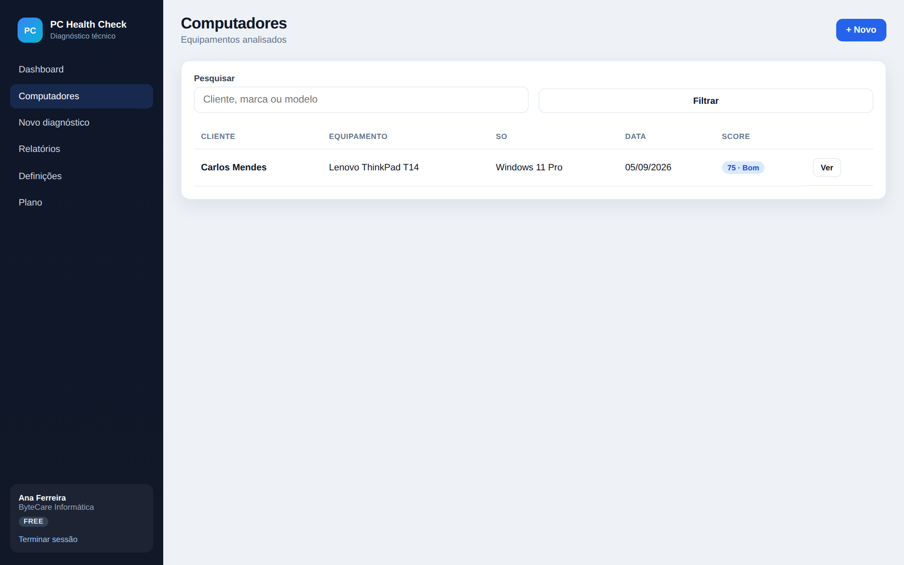

## Pré-visualização do relatório

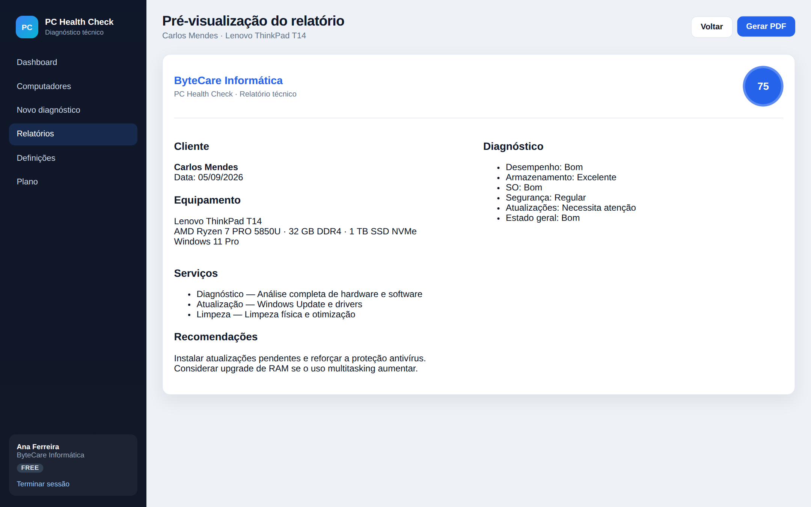

## Relatórios gerados

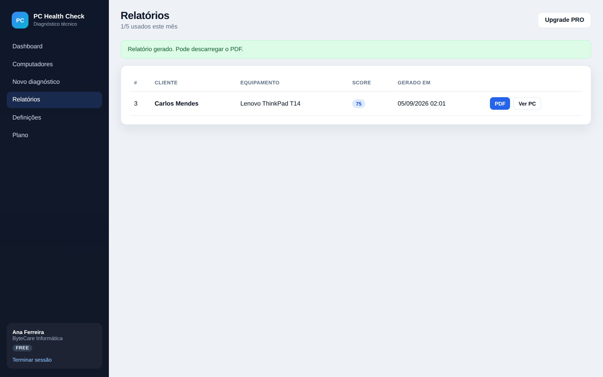

## PDF gerado (1.ª página)

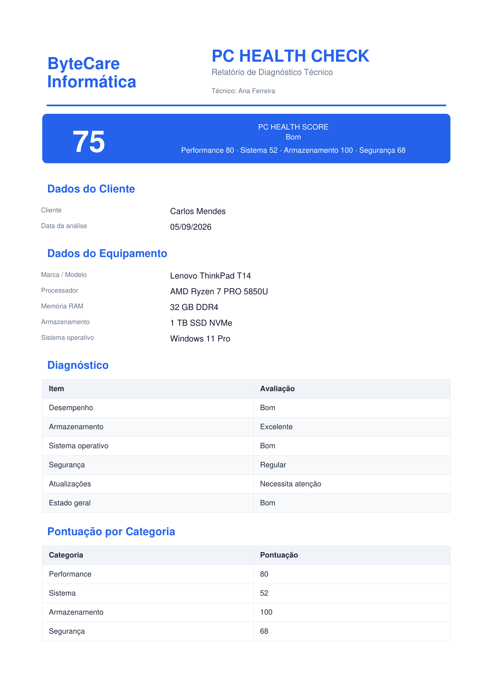

Ficheiro de exemplo: [`sample-report.pdf`](screenshots/sample-report.pdf)

## Definições e planos

| Perfil | Plano FREE | Plano PRO |
|--------|------------|-----------|
| 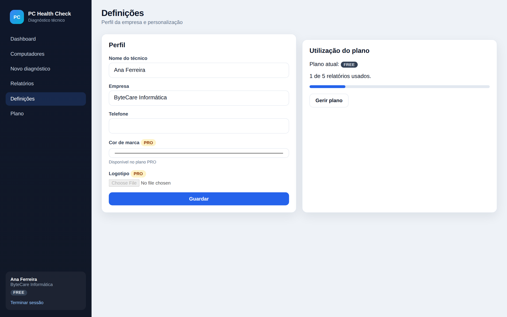 | 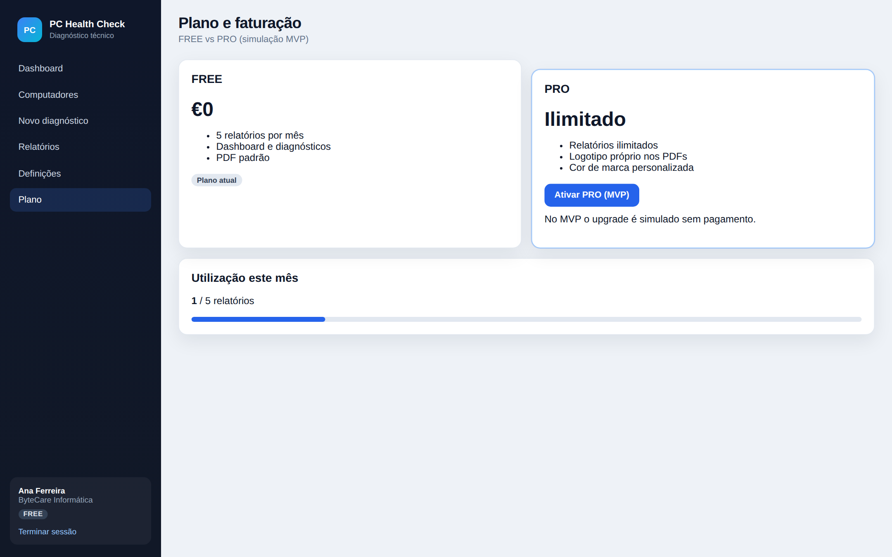 | 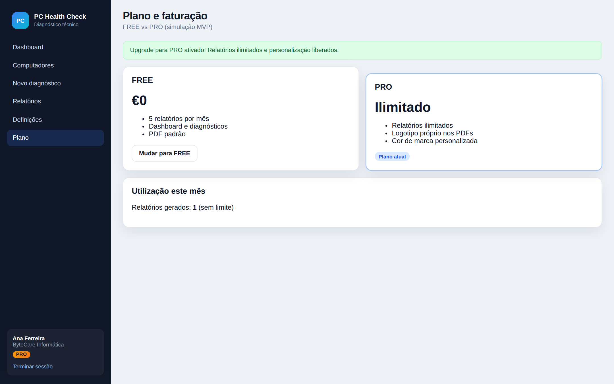 |

Definições com personalização PRO (cor / logo):

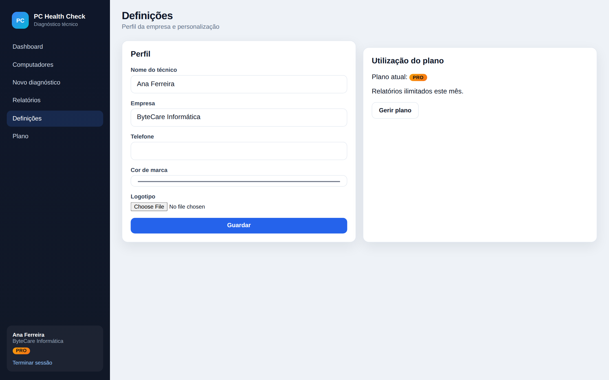

---

Para regenerar as capturas (requer servidor em `http://127.0.0.1:5000` e Playwright):

```bash
python scripts/capture_screenshots.py
```
